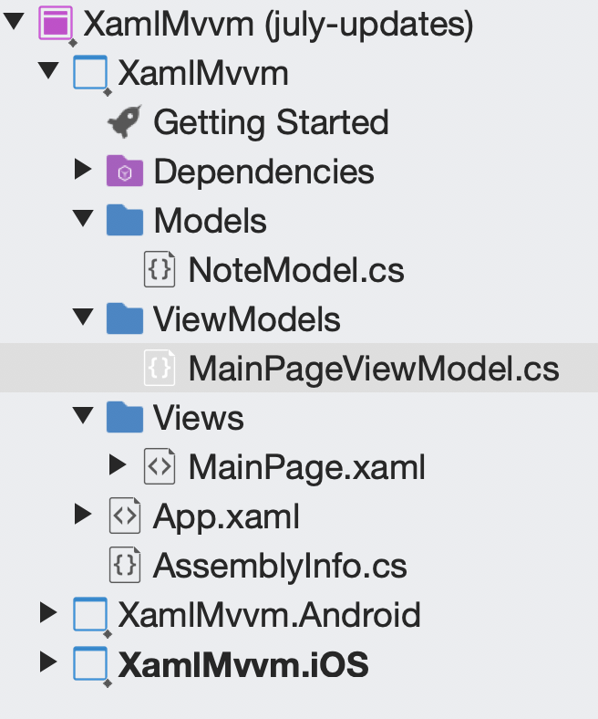

# Xamarin.Forms MVVM with XAML

MVVM - or Model View View-Model is a great way to add interactivity to your Xamarin.Forms application without having to add in event handlers to provide business logic or to update your user interface.

Events in MVVM are known as `Command`s and are handled by the Xamarin.Forms framework.

Properties of controls are updated through a process called binding. And again, all the hard work of updating the property's value happens via the framework, you only need to set the property to a value.

## New Starting Point

The code has changed a bit since the end of the UI episode. Mainly it's the file structure in the core Xamarin.Forms project.

Since MVVM projects have Views (or the pages), View Models (or the brains), and Models (or the data representation) and they are all separate classes - it makes sense to keep them in separate folders in the solution.

So what I did was created 3 new folders.

- Views
- ViewModels
- Models



I moved the `MainPage.xaml` and its code-behind file `MainPage.xaml.cs` into the Views folder.

Then in the Models folder, I created a new class called `NoteModel`. The purpose of this class is to _model_ the data that appears on the screen. In other words, it needs to represent a note, so the only property it has is a `string` named `Text`.

Finally I created a new class called `MainPageViewModel` in the ViewModels folder. That class will be the view model for the `MainPage.xaml` page. And 99 times out of 100, you'll have a 1:1 relationship between pages and view models.

So now go [checkout the video for more some more info on MVVM with Xamarin.Forms](https://channel9.msdn.com/Series/Xamarin-101/XamarinForms-MVVM-with-XAML-6-of-11?WT.mc_id=xamarin101-github-masoucou).

When you get back we'll talk a bit about some things in the code in this repo.

## The Code

The video covered MVVM - mainly [data binding](https://docs.microsoft.com/xamarin/xamarin-forms/xaml/xaml-basics/data-binding-basics?WT.mc_id=xamarin101-github-masoucou) and [commands](https://docs.microsoft.com/xamarin/xamarin-forms/app-fundamentals/data-binding/commanding?WT.mc_id=xamarin101-github-masoucou). Check out those links for more in-depth info, they're definitely worth your time.

In the code with this README you'll find a lot of interesting stuff in the `MainPageViewModel`, including something that wasn't covered in the video.

In addition to responding to events, commands can also tell the control they are bound to whether to be enabled or not. In other words, you can set up conditions that must be present in order for the command action to happen.

In this case, the note field must have text in it in order for the save button to be enabled.

```c-sharp
SaveNoteCommand = new Command(() =>
{
    Notes.Add(new NoteModel { Text = NoteText });
    NoteText = string.Empty;
},
() => !string.IsNullOrEmpty(NoteText));
```

It's that second `Action` which is evaluating whether the command should be enabled or not.

Then since the command then relies on the `Note` property, whenever the value gets set, it also invokes `SaveNoteCommand.CanChangeExecute()`. This then files that evaluation action and then when enable or disable the control.

```c-sharp
public string NoteText
{
    get => noteText;
    set
    {
        noteText = value;
        PropertyChanged?.Invoke(this,
            new PropertyChangedEventArgs(nameof(NoteText)));

        SaveNoteCommand.ChangeCanExecute();
    }
}
```

You could call `SaveNoteCommand.ChangeCanExecute()` from anywhere. But it makes the most sense to invoke it right after the `Note`'s value has changed.

Data's bound, commands are firing, controls are properly enabled. In the next episode you'll find out how to move between Xamarin.Forms pages with navigation.